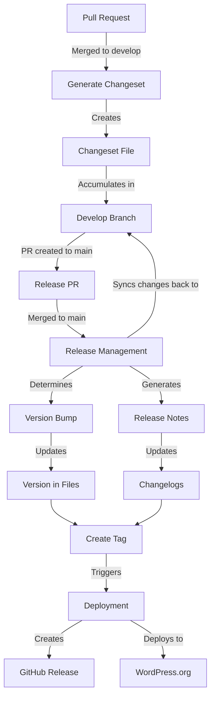
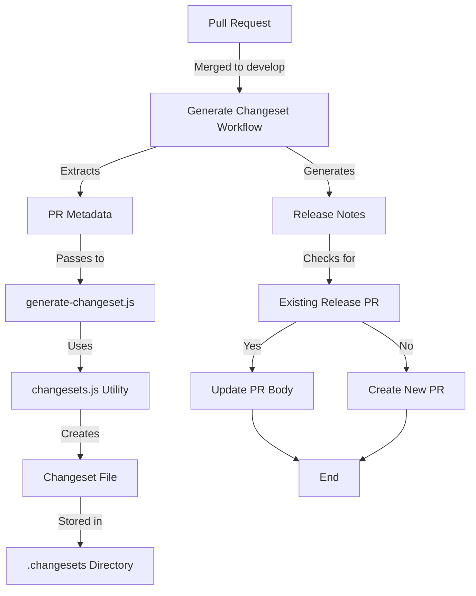
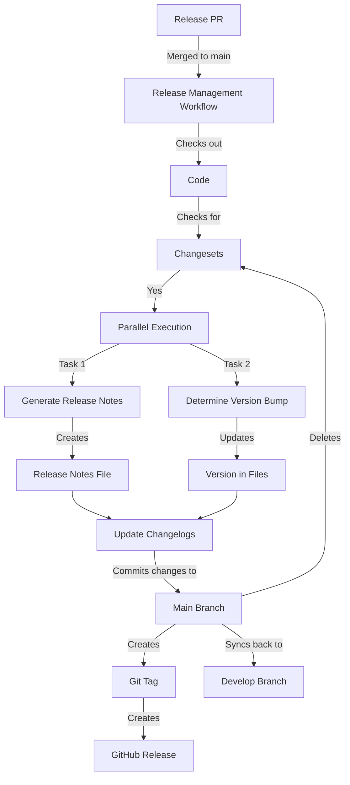
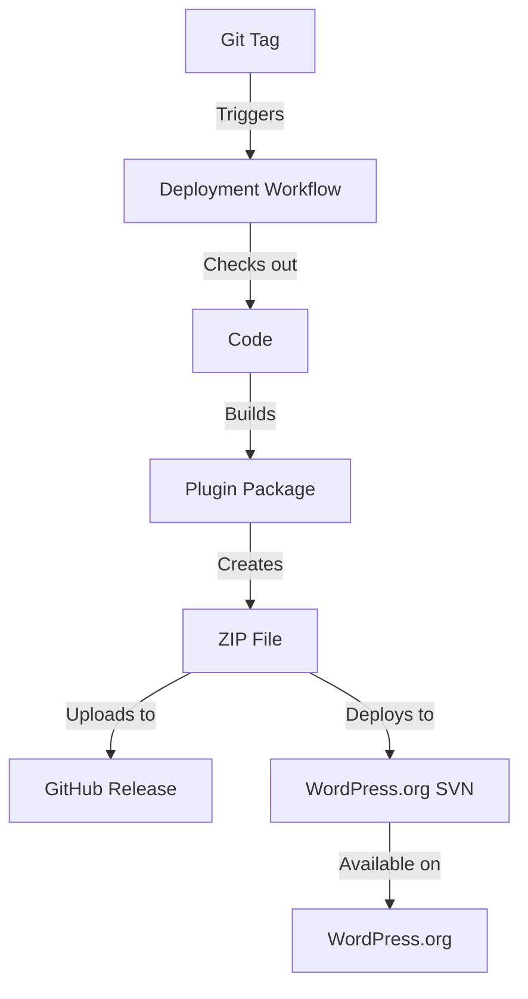
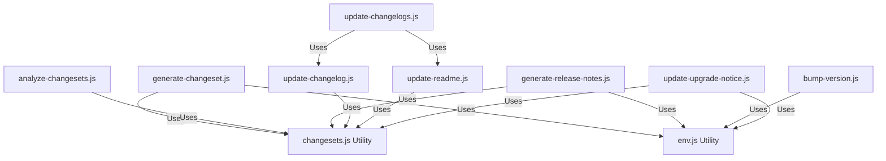
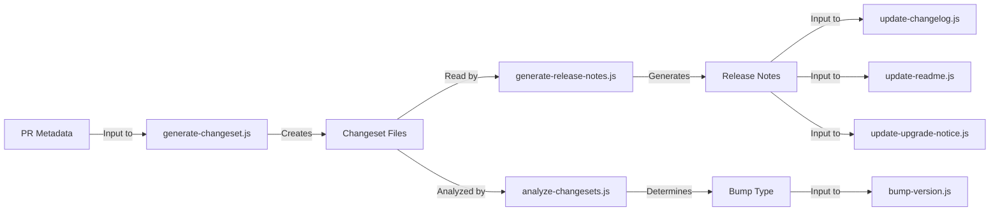
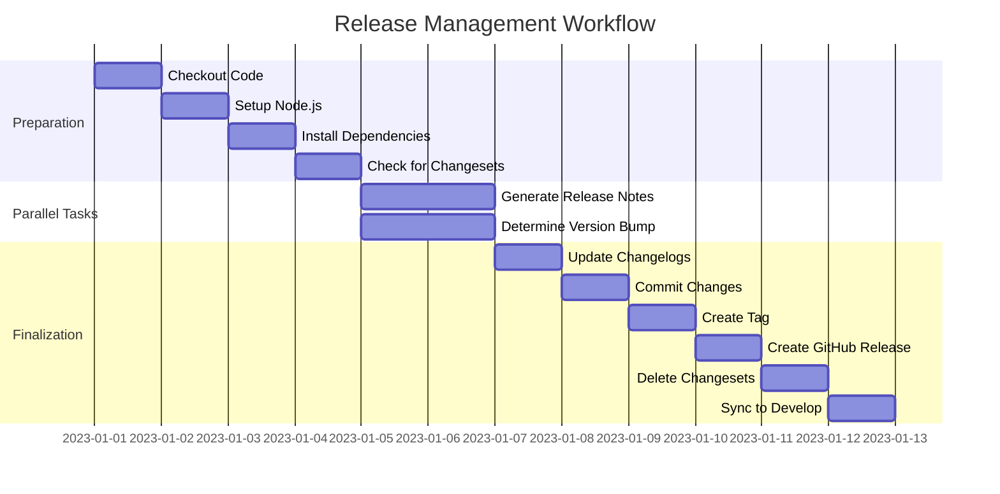
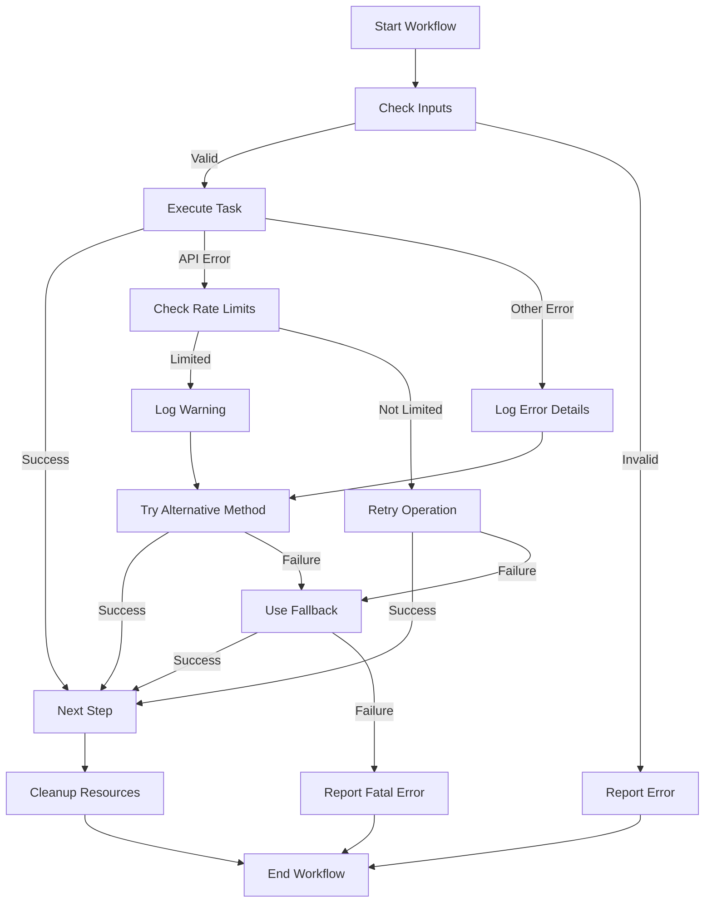
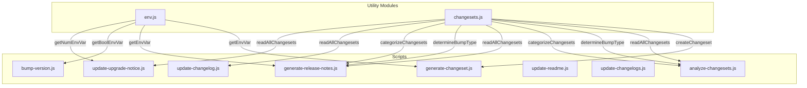

# Workflow Visualizations

This document provides visual representations of the automation workflows used in this repository. These diagrams help to understand how the different components interact and the flow of operations during the release process.

## Overall Release Process



## Changeset Generation Workflow



## Release Management Workflow



## Deployment Workflow



## Script Dependencies



## Data Flow



## Parallel Execution in Release Management



## Error Handling Strategy



## Utility Module Usage



## Branch Strategy

```mermaid
gitGraph
    commit id: "Initial commit"
    branch develop
    checkout develop
    commit id: "Feature 1"
    commit id: "Feature 2"
    commit id: "Generate changeset for Feature 2"
    commit id: "Feature 3"
    commit id: "Generate changeset for Feature 3"
    checkout main
    merge develop id: "Release v1.0.0" tag: "v1.0.0"
    checkout develop
    merge main id: "Sync main back to develop"
    commit id: "Feature 4"
    commit id: "Generate changeset for Feature 4"
    checkout main
    merge develop id: "Release v1.1.0" tag: "v1.1.0"
    checkout develop
    merge main id: "Sync main back to develop"
```

These visualizations provide a comprehensive overview of how the different components of the automation system interact. They can be especially helpful for new contributors to understand the workflow and for maintainers to identify potential areas for improvement. 